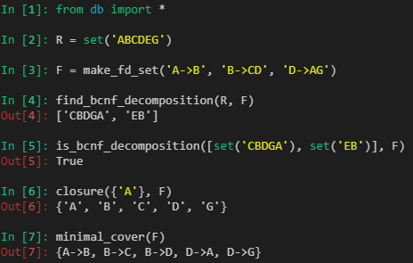

# db-design-theory

Implementations for relational database design theory algorithms:

- Closure
- Minimal cover
- Projection
- Check for dependency preservation
- Check and find BCNF decomposition
- Check and find 3NF decomposition

## Usage Example

## Known Issues

- Does not implement is_lossless() to find whether or not a decomposition is lossless-join.
